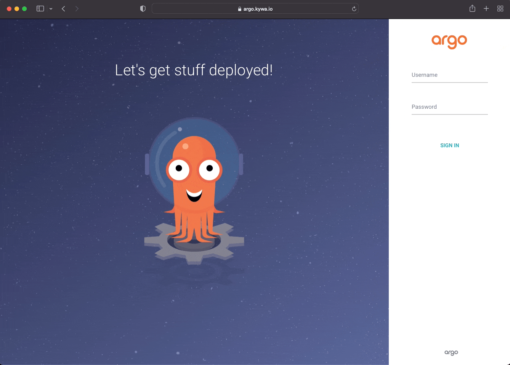

# ArgoCD for mineOps

Since it seems we are now using Kubernetes and our CEO is happy and doesn't appear to be playing buzzword bingo anymore, its time to do something for us to make our lives easier. After spending some time scouring the internet, it looks like we may have found what we need, [ArgoCD](https://argoproj.github.io/cd/). It seems like we've heard it come up in our Twitter feeds, Reddit and wherever else dope technology is talked about. It seems like it handles GitOps, whatever that is, but most importantly it keeps manifests applied and correct in our Kubernetes cluster(s). But what does that really mean? Let's take a tour of what ArgoCD is and how it is going to help us manage all of these customer Minecraft Servers running on Kubernetes.

## What are we trying to solve?

Since we now have our customer Minecraft Servers running on Kubernetes and we can create new ones with `kubectl create`, do we wan't to keep up with a `kubecofig` for each person on our development team, what do we do? We can keep doing this, but it gets tiring having to get more `kubeconfig`s for each new team member and really doesn't make auditing super easy (really borderline impossible in a vanilla Kubernetes cluster). There may be some other items, but here are our core focuses on what we are needing for our sanity:

* An easy way to deploy new customer Minecraft Servers
* Not require giving new team members a `kubeconfig` file
* Some form of auditing of who created/deployed what

### How does ArgoCD help us?

Thankfully based on the items we have determined above, ArgoCD can handle most of these items (and more) without really having to change much of what we do. That is fine and dandy saying that, but what exactly does ArgoCD "do"? Argo itself is actually just the name of a group of projects (and a company I guess?) with ArgoCD being one of those projects. The CD stands for Continuous Delivery, which is something that up until now "we in this company" haven't really ever dealt with. In short it takes changes you've made (ideally in a Git repository somewhere) and then... continuously delivers/deploys them. On the surface it is actually quite simple, but the how and when is what is important. So that seems to lead mostly to an answer for the first item in our list, but does leave us still with the "how" of it. In [Part 3]() we moved all of our configuration files into Git and they are just sitting there doing nothing. What if they could "do" something? This is where ArgoCD comes in and the "how" of the CD portion of its namesake. ArgoCD can be utilized to implement a neat framework that some may consider a "buzzword" (we can use those too if we want Mr. CEO) called GitOps, but it is so much more than just a buzzword. It is honestly an amazing way of handling the automation of your CI/CD changes and really shines in a matured DevOps culture, which hopefully by now we can consider ourselves that.

For the issue of getting new team members access to Kubernetes to be able to run `kubectl` commands against, we don't even need to bother with that. ArgoCD itself (typically) lives in the Kubernetes cluster as its own application and is checking a Git repository (or even a Helm Repository for those who've gone a little further in their Kubernetes maturity) for any changes. Since every team member in theory who is going to be making changes, would use Git, nothing needs to be changed in terms of an access model to our Kubernetes clusters. ArgoCD only cares about what is in the cluster and what is in Git. You don't even really need to grant anyone access to ArgoCD itself unless there is some form of an issue. 

With the previous question answered, we technically also have our answer as to what we need for some form of audit. Git handles auditing very, very well, so well in fact as stated before, you can literally use the word `blame` to find out who changed what in a file. Between this existing functionality of Git and using Pull Requests that require approvals/reviews, we can easily audit what changes actually go into our cluster. On top of those things, ArgoCD itself has a pretty amazing view of who did what right from the UI, which is really just reporting what Git says. 

We've roughly got our what we believe we need to make this all work right out of the box with ArgoCD and Git. And we've got our "buzzword" GitOps, which is something we are really going to focus on. In a perfect world, no one would have direct access to our Kubernetes clusters and we would have everything audited through Git, applied via ArgoCD and happily running with 0 manual intervention. We can absolutely get here and there is nothing stopping us from doing that outside of a little growing pain.

### The "Endgame" of GitOps

briefly touched on it, tldr no one actually touches kubernetes and Git is the sole soure of truth

## Installing ArgoCD

As discussed during the outline of ArgoCD I mentioned that ArgoCD typically lives in the Kubernetes cluster where it is deployed. There are other methods where you could technically have a "central" ArgoCD that manages multiple Kubernetes clusters. We will not be focusing on that method as it requires quite a bit more setup and there is nothing lacking if we have 1 ArgoCD instance per Kubernetes cluster (especially since we aren't growing past this during the mineOps series).

### Full Declarative

Note that there are other ways to deploy argocd and the "get going" manifests such as the repository and admin configuration

### Helm Chart, Raw Manifests

Ideally the best way to install ArgoCD is up to the team who is going to be doing the actual install. The method we are going to pursue is through just normal YAML manifests. I would personally use Helm to deploy this, but learning Helm isn't a necessary for the mineOps series, but a follow up post may be in the works. The fastest way to get the ArgoCD manifests is to obtain them from the [Argo Project's GitHub repository for ArgoCD](https://github.com/argoproj/argo-cd). In this repository there are many great things to look at, but for the most part we are primarly focused on one directory and that is the `manifests` directory which contains the most obvious of YAML files, `install.yaml`. We breifly mentioned this in Part 5, but `kubectl` can be used to target not just local files, but also URLs as well. It looks just like how we would normally apply a manifest, so lets get it going:

```yaml
$ kubectl create namespace argocd
namespace/argocd created
$ kubectl apply -n argocd -f https://raw.githubusercontent.com/argoproj/argo-cd/master/manifests/install.yaml
customresourcedefinition.apiextensions.k8s.io/applications.argoproj.io created
customresourcedefinition.apiextensions.k8s.io/applicationsets.argoproj.io created
customresourcedefinition.apiextensions.k8s.io/appprojects.argoproj.io created
serviceaccount/argocd-application-controller created
serviceaccount/argocd-applicationset-controller created
serviceaccount/argocd-dex-server created
serviceaccount/argocd-notifications-controller created
serviceaccount/argocd-redis created
serviceaccount/argocd-server created
role.rbac.authorization.k8s.io/argocd-application-controller created
role.rbac.authorization.k8s.io/argocd-applicationset-controller created
role.rbac.authorization.k8s.io/argocd-dex-server created
role.rbac.authorization.k8s.io/argocd-notifications-controller created
role.rbac.authorization.k8s.io/argocd-server created
clusterrole.rbac.authorization.k8s.io/argocd-application-controller created
clusterrole.rbac.authorization.k8s.io/argocd-server created
rolebinding.rbac.authorization.k8s.io/argocd-application-controller created
rolebinding.rbac.authorization.k8s.io/argocd-applicationset-controller created
rolebinding.rbac.authorization.k8s.io/argocd-dex-server created
rolebinding.rbac.authorization.k8s.io/argocd-notifications-controller created
rolebinding.rbac.authorization.k8s.io/argocd-redis created
rolebinding.rbac.authorization.k8s.io/argocd-server created
clusterrolebinding.rbac.authorization.k8s.io/argocd-application-controller created
clusterrolebinding.rbac.authorization.k8s.io/argocd-server created
configmap/argocd-cm created
configmap/argocd-cmd-params-cm created
configmap/argocd-gpg-keys-cm created
configmap/argocd-notifications-cm created
configmap/argocd-rbac-cm created
configmap/argocd-ssh-known-hosts-cm created
configmap/argocd-tls-certs-cm created
secret/argocd-notifications-secret created
secret/argocd-secret created
service/argocd-applicationset-controller created
service/argocd-dex-server created
service/argocd-metrics created
service/argocd-notifications-controller-metrics created
service/argocd-redis created
service/argocd-repo-server created
service/argocd-server created
service/argocd-server-metrics created
deployment.apps/argocd-applicationset-controller created
deployment.apps/argocd-dex-server created
deployment.apps/argocd-notifications-controller created
deployment.apps/argocd-redis created
deployment.apps/argocd-repo-server created
deployment.apps/argocd-server created
statefulset.apps/argocd-application-controller created
networkpolicy.networking.k8s.io/argocd-application-controller-network-policy created
networkpolicy.networking.k8s.io/argocd-dex-server-network-policy created
networkpolicy.networking.k8s.io/argocd-redis-network-policy created
networkpolicy.networking.k8s.io/argocd-repo-server-network-policy created
networkpolicy.networking.k8s.io/argocd-server-network-policy created
```

Based on the output above, we have just created quite a few new objects in our cluster. For the most part this is just a bunch of RBAC rules to allow the various compontents of ArgoCD to do all of the things it does. The rest is mostly 

### Accessing ArgoCD

To access the web front end of ArgoCD, we will need an `Ingress` object to route our traffic to ArgoCD. Here is a simple manifest for such an Ingress object. Please note you do not actually need to use the web front end to make use of ArgoCD as it will work on its own, but if you wish to use the `argocd` client or view from the web front end to manage things, you will need an `Ingress` object (or a Gateway/VirtualService etc...).

```yaml
apiVersion: networking.k8s.io/v1
kind: Ingress
metadata:
  name: argocd
  namespace: argocd
  annotations:
    kubernetes.io/ingress.class: nginx
    nginx.ingress.kubernetes.io/force-ssl-redirect: "true"
    nginx.ingress.kubernetes.io/ssl-passthrough: "true"
    nginx.ingress.kubernetes.io/backend-protocol: "HTTPS"
spec:
  rules:
  - host: "argo.kywa.io"
    http:
      paths:
        - path: /
          pathType: Prefix
          backend:
            service:
              name: argocd-server
              port:
                name: https
  tls:
  - hosts:
    - argo.kywa.io
```

**NOTE** Some of these annotations can be removed by changing the configuration of ArgoCD's settings in the ConfigMap `argocd-cm`, but are required for a "default" installation of ArgoCD along with `ingress-nginx`.

ArgoCD is deployed and seems to be up and running, we can get to the web application, but we don't have a login. By default ArgoCD creates an initial admin password which can be found in a secret in the namespace that ArgoCD is installed in. To view the `Secret` and get the password to login initially here is a quick handy one liner:

```sh
$ kubectl get secret -n argocd argocd-initial-admin-secret -o jsonpath='{.data.password}' | base64 -d
Z1Ha6-z8QVR2jC0b
```

Later in this guide we will be doing things in a more declarative process and will not be needing to do the manual secret getting. Now let's try to login to our newly installed ArgoCD instance.

[](#)

## Using ArgoCD

Now that we've logged into the UI, we are met with an amazingly detailed blank screen. 

### Repository

#### Declarative

#### GUI

### Application

### Repository Setup

#### App of Apps

## Extras and Nice to Haves

### Secrets

not discussed during kubernetes, but mentioning now for the future

easy setup, kubeseal
